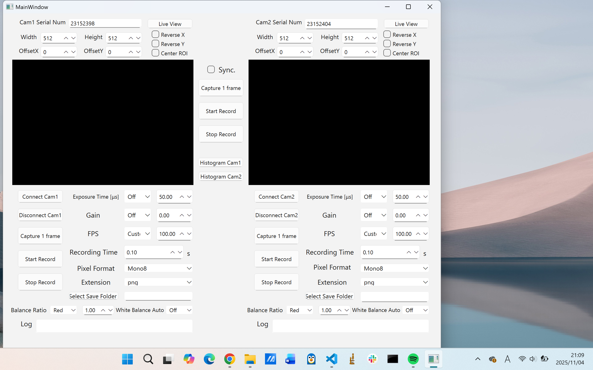
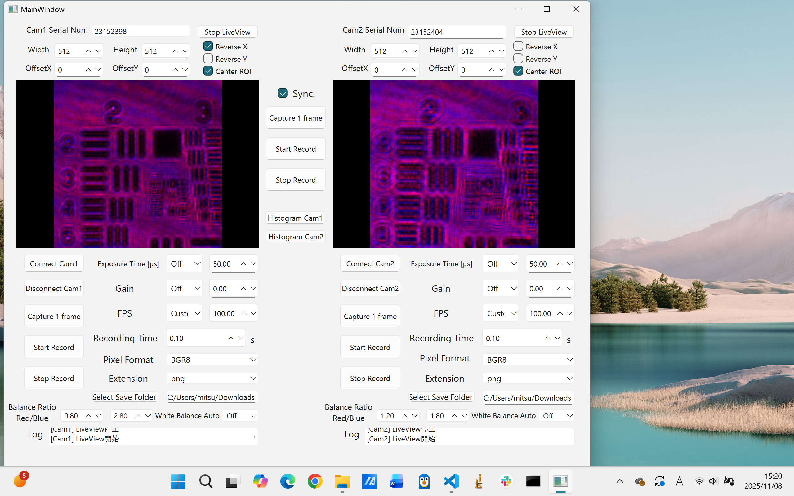
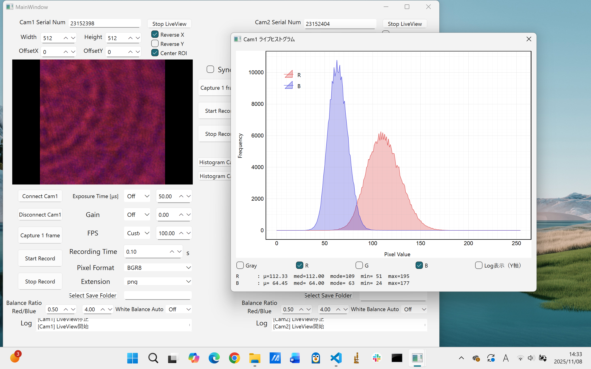

# 📷 Dual FLIR カメラ制御アプリ
*A Dual FLIR Camera Control Application for synchronized optical imaging and recording.*

---

## 🧭 概要（Overview）

2台の FLIR カメラを **GUI 上から個別または同期** で制御・撮影・録画できるアプリケーションです。  
Teledyne FLIR 社の公式 Spinnaker SDK（Python バインディング：PySpin）を使用しており、  
**外部トリガによるハードウェア同期撮影** にも対応しています。

---

## 🖥 アプリ外観
<p align="center">
  <figure style="display:inline-block; text-align:center; margin:10px;">
    
    <figcaption>起動直後の画面（カメラ未接続）</figcaption>
  </figure>
  <figure style="display:inline-block; text-align:center; margin:10px;">
    
    <figcaption>カメラ接続・ライブ表示中の画面</figcaption>
  </figure>
</p>

<p align="center">
  <figure style="text-align:center;">
    
    <figcaption>ヒストグラム表示（Gray + RGB）</figcaption>
  </figure>
</p>


---

## 🌟 主な特徴（Main Features）

| 分類 | 機能 | 説明 |
|------|------|------|
| 🔢 **カメラ識別** | シリアル番号指定 | 各カメラを個別のシリアル番号で認識・接続 |
| 🎥 **カメラ接続制御** | 接続／切断 | GUI上からカメラ1・2を個別に接続／切断可能 |
| 🖼 **画像サイズ設定** | Width／Height／CenterROI | ROIをセンター寄せまたは任意サイズで設定 |
| 📍 **位置調整** | X／Y Offset | ROI位置を個別に微調整可能 |
| ⚙ **撮影パラメータ** | 露光時間・ゲイン・FPS | GUI上でリアルタイム変更／同期調整対応 |
| ⏱ **記録設定** | 録画時間指定 | 秒数を指定して安定した録画を実行 |
| 🗂 **保存形式** | 画像フォーマット／拡張子 | RAW, TIFF などフォーマット・拡張子を選択可 |
| 📁 **保存先設定** | 出力フォルダ変更 | カメラごとに保存ディレクトリ指定可能 |
| ⚪ **ホワイトバランス** | Auto（Off／Once／Continuous） | BalanceWhiteAuto ノード制御による自動調整 |
| 🔴 **Balance Ratio** | Red／Blue | BalanceRatioSelector ノードで個別設定可能 |
| 📸 **撮影モード** | シングル／連続フレーム撮影 | 各カメラ単体またはハード同期で撮影 |
| 🔄 **ハード同期撮影** | Line3 トリガ対応 | Primary → Secondary 間で外部信号による同期撮影 |
| 🖥 **ライブビュー** | OpenGL描画 | PySide6 + OpenGL によるリアルタイム表示 |
| 🧮 **ヒストグラム** | Gray + RGB | 撮影画像の輝度分布をリアルタイムで可視化 |
| 📡 **ログ出力** | リアルタイム表示 | カメラ操作・撮影結果・例外を即時ログ表示 |
| 🧵 **スレッド制御** | QThread録画処理 | GUI応答性を維持しながら録画を非同期実行 |
| 🧠 **自動補正** | FPS／ROI補正 | カメラ仕様範囲内に自動クランプして安全化 |
| 🧰 **エラーハンドリング** | PySpin例外検知 | 未対応ノード・設定範囲外を安全に検出 |

---

## 🔧 カメラ制御構成（Camera Architecture）

- **PrimaryCamera（親）**：ソフトウェアまたは外部トリガで撮影可能。必要に応じて Line 出力でトリガ送信。  
- **SecondaryCamera（子）**：Line3 からの外部トリガを受けて同期撮影を実行。  
- FPS・ROI・露光などの整合性は自動的に補正され、カメラ仕様に準拠した安全動作を保証。

---

## 🧵 録画処理とスレッド構成（Thread Architecture）

- CameraWorker クラスにより録画処理を **QThread** 上で実行  
- GUIと非同期動作し、滑らかな録画体験を実現  
- エラー発生時はシグナル経由でログに即時反映  

---

## 🧩 UIファイル（.ui → .py 変換方法）

Qt Designer で設計した `.ui` ファイル（例：mainwindow.ui）は、  
**PySide6 の UI コンパイラ (pyside6-uic)** を使用してPythonコードへ変換します。

```bash
pyside6-uic mainwindow.ui -o ./ui/ui_mainwindow.py
```

💡 PowerShell 例（Windows）
```powershell
micromamba activate flir
pyside6-uic mainwindow.ui -o .\ui\ui_mainwindow.py
```

⚠️ **注意**  
- 日本語パスやスペースを含むフォルダではエラーが出る場合があります  
- .uiを更新した際は再度上記コマンドを実行してください  

---

## 📁 ディレクトリ構成

```txt
DualFLIRCamControlApp/
├── main.py                       # アプリ起動とGUI接続
├── camera_control/
│   ├── camera_controller.py     # カメラ制御統括
│   ├── primary_camera_gui.py    # 親カメラ制御
│   ├── secondary_camera_gui.py  # 子カメラ制御
│   ├── camera_worker.py         # 録画処理ワーカー
│   └── camera_live_worker.py    # ライブビュー処理ワーカー
├── ui/
│   └── ui_mainwindow.py         # GUI構成（自動生成）
├── util/
│   ├── log_helper.py            # ログ出力整形
│   └── camera_discovery.py      # カメラ検出
├── outputs/                     # 保存先（画像・動画）
└── .gitignore                   # 除外設定
```

---

## 💻 動作環境（Environment）

- **OS**：Windows 10 / 11（FLIR SDK対応）  
- **Python**：3.8〜3.10  
- **主要依存パッケージ：**
  - PySide6  
  - numpy  
  - PyOpenGL  
  - PySpin（＝Spinnaker SDK Python バインディング）

---

## ⚙️ 開発環境構築（Setup Guide）

詳細な環境構築手順は以下を参照してください👇  
📘 [環境構築手順書 (README_ENV_SETUP.md)](./README_ENV_SETUP.md)

---

## ⚠️ PySpin の注意点（About PySpin）

- **pip ではなく公式 .whl ファイルからインストール**
```bash
pip install spinnaker_python-4.2.0.88-cp310-cp310-win_amd64.whl
```

📘 公式ダウンロード：  
👉 [Spinnaker SDK Downloads](https://www.teledynevisionsolutions.com/support/support-center/software-firmware-downloads/iis/spinnaker-sdk-download/spinnaker-sdk--download-files/?pn=Spinnaker+SDK&vn=Spinnaker+SDK)

---

## 🚀 起動方法（Run）

```bash
python main.py
```

---

## 🧾 免責事項（Disclaimer）

本アプリは個人の研究・学習目的で開発されたものであり、  
使用に伴ういかなる損害についても、作者は責任を負いません。  
ご利用は自己責任でお願いいたします。
